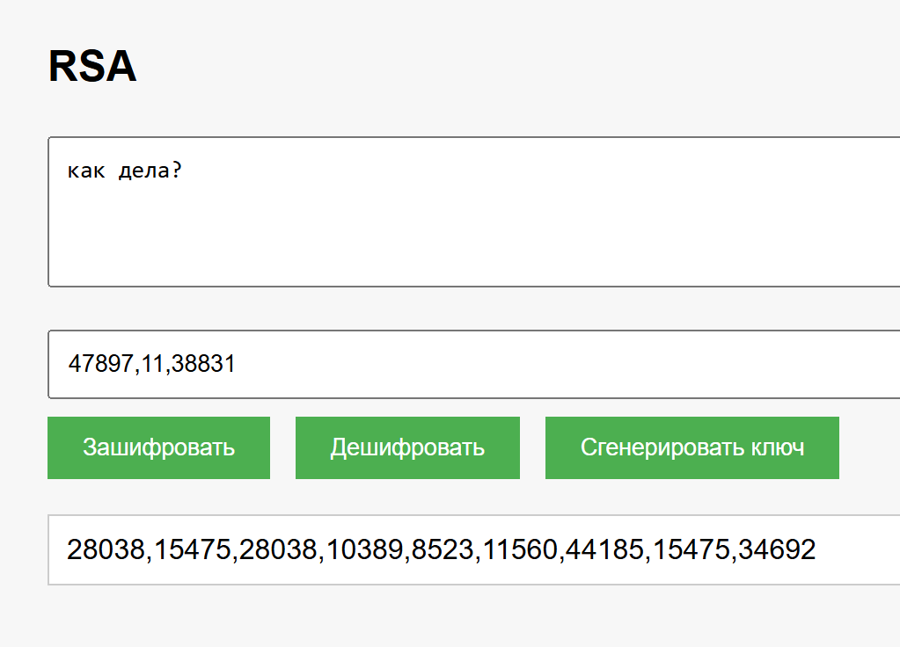
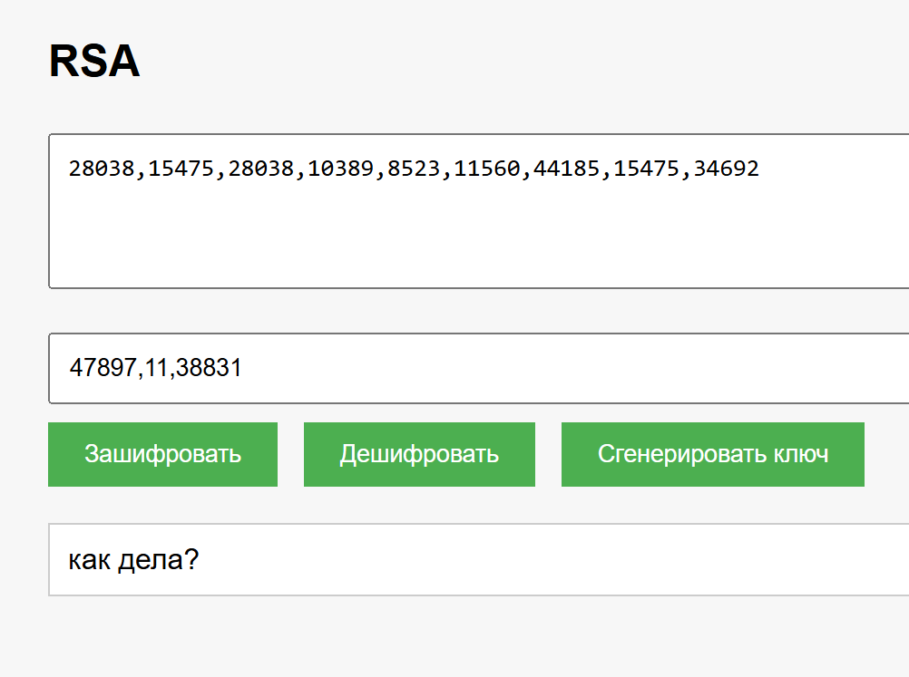

# RSA Шифрование

## Описание
Данный проект представляет собой веб-приложение для шифрования и дешифрования текста с использованием алгоритма RSA. Приложение разработано на C# (.NET 8.0) с использованием WebSocket для взаимодействия между клиентом и сервером.

## Краткое описание метода шифрования
RSA (Rivest–Shamir–Adleman) - это асимметричный алгоритм шифрования, использующий пару ключей:
- Публичный ключ (n, e) для шифрования
- Приватный ключ (n, d) для дешифрования

где:
- n - произведение двух простых чисел
- e - открытая экспонента  
- d - секретная экспонента

Ключи в приложении выводятся в формате: `n,e,d`

## Структура проекта
- **Handlers/**
  - `WebSocketHandler.cs`: Обработчик WebSocket-соединений
- **Models/**
  - `RequestMessage.cs`: Модель запроса
  - `ResponseMessage.cs`: Модель ответа 
- **Services/**
  - `CipherService.cs`: Сервис реализующий RSA шифрование/дешифрование
- **wwwroot/**
  - `index.html`: Веб-интерфейс приложения
  - `script.js`: Клиентская логика
  - `style.css`: Стили интерфейса
- `Program.cs`: Точка входа в приложение
- `Startup.cs`: Конфигурация приложения

## Запуск проекта
1. Убедитесь, что установлен .NET 8.0 SDK
2. Клонируйте репозиторий
3. В терминале выполните:
    ```sh
    dotnet run
    ```
4. Откройте браузер и перейдите по адресу `http://localhost:5000`

## Возможности веб-интерфейса
- Генерация ключевой пары RSA
- Шифрование введенного текста с помощью публичного ключа
- Дешифрование текста с помощью приватного ключа
- Сохранение/загрузка существующих ключей

## Примеры использования

### Шифрование текста
1. Сгенерируйте новую пару ключей кнопкой "Сгенерировать ключ"
2. Введите текст для шифрования
3. Нажмите "Зашифровать"

### Дешифрование текста  
1. Введите зашифрованный текст
2. Укажите правильный ключ
3. Нажмите "Дешифровать"

## Скриншоты

### Шифрование текста


### Дешифрование текста
